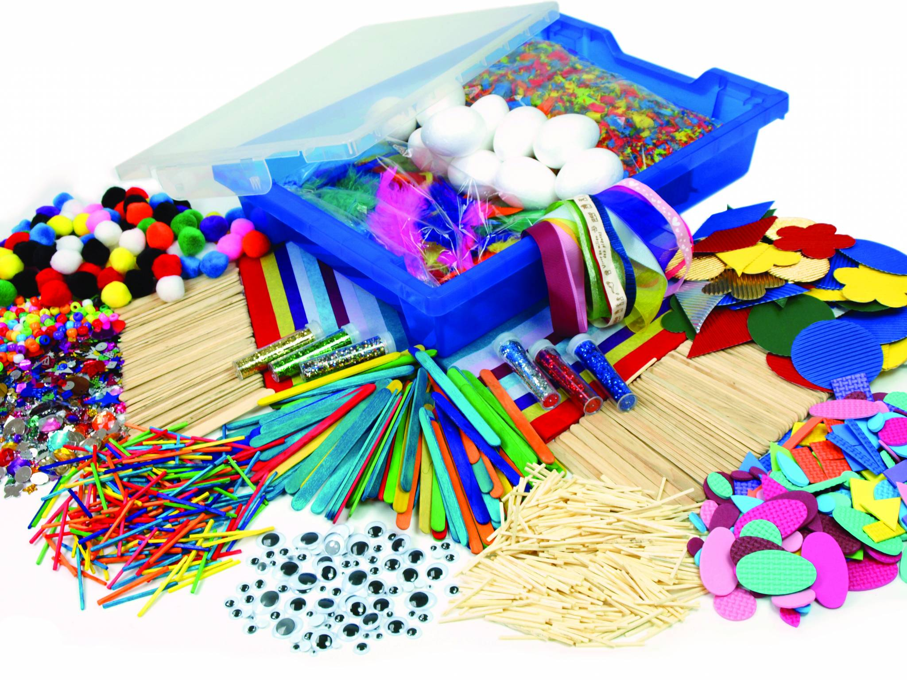
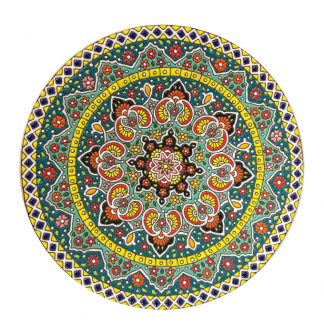
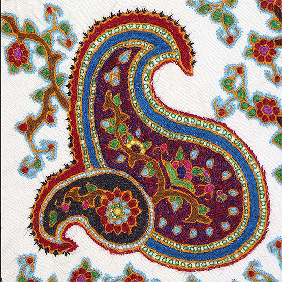
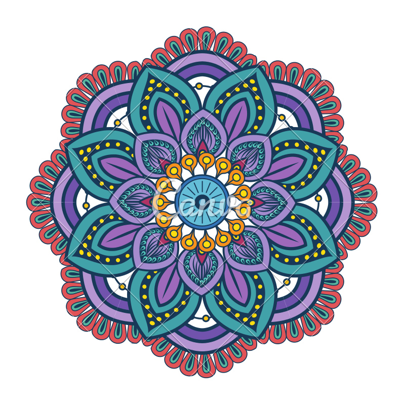

<!DOCTYPE html>
<html lang="fa">
<head>
    <meta charset="UTF-8">
    <meta name="viewport" content="width=device-width, initial-scale=1" >

    <link rel="stylesheet" href="pro_6.css" type="text/css">
    

    <link rel="stylesheet" href="https://maxcdn.bootstrapcdn.com/bootstrap/3.4.0/css/bootstrap.min.css">
    
    

    <title>NeginSite</title>
</head>
<body data-spy="scroll" data-target=".navbar" data-offset="50">

<nav class="navbar navbar-inverse navbar-fixed-top">
    

        

            <button type="button" class="navbar-toggle" data-toggle="collapse" data-target="#myNavbar">
                
                
                
            </button>
            
            <a class="navbar-brand" href="#">NeginSite</a>
        

            

                <ul class="nav navbar-nav">
                    <li><a href="#section1">خانه</a></li>
                    <li><a href="#section2">خدمات سایت</a></li>
                    <li><a href="#section3">اسلایدر</a></li>
                    <li class="dropdown"><a class="dropdown-toggle" data-toggle="dropdown" href="#">گالری </a>
                            <ul class="dropdown-menu">
                            <li><a href="#section41">عکس</a></li>
                            <li><a href="#section42">ویدئو</a></li>
                        </ul>
                    </li>
                    <li><a href="#section5">تماس با ما</a></li>
                    <li><a href="#section7"> ماشین حساب و تقویم</a></li>
                    <li><a href="#section9">سرگرمی</a></li>
                </ul>
            

        <ul class="nav navbar-nav navbar-right">
            <li><a data-toggle="modal" data-target="#loginModal"> login</a></li>
            <li><a data-toggle="modal" data-target="#signupModal"> signup</a></li>
        </ul>
        

    

</nav>

    

        

            

                <button type="button" class="close" data-dismiss="modal"> &times;</button>
                <h4>Login</h4>
            

            

                <form class="form-inline">
                    

                        <label class="sr-only" for="email">Email</label><input type="text" class="form-control input-sm" placeholder="Email" id="email" name="email">
                    

                    

                        <label class="sr-only" for="password">Password</label>
                        <input type="password" class="form-control input-sm" placeholder="Password" id="password" name="password">

                    

                        <label>
                            <input type="checkbox"> Remember me
                        </label>
                    

                    <button type="submit" class="btn btn-info btn-xs">Sign in</button>
                    <button type="button" class="btn btn-default btn-xs" data-dismiss="modal">Cancel</button>

                </form>
            

            <!--
                        

                            

                        

            -->
        

    

    

        

            

                <button type="button" class="close" data-dismiss="modal"> &times;</button>
                <h4>signup</h4>
            

            

                <form class="form-inline">
                    

                        <label class="sr-only" for="name">Name</label><input type="text" class="form-control input-sm" placeholder="Name" id="name" name="name">
                    

                    

                        <label class="sr-only" for="email">Email</label><input type="text" class="form-control input-sm" placeholder="Email" id="mail" name="email">
                    

                    

                        <label class="sr-only" for="username">Username</label><input type="text" class="form-control input-sm" placeholder="Username" id="username" name="username">
                    

                    

                        <label class="sr-only" for="password">Password</label>
                        <input type="password" class="form-control input-sm" placeholder="Password" id="passsword" name="password">

                    

                        <label>
                            <input type="checkbox"> Remember me
                        </label>
                    

                    <button type="submit" class="btn btn-info btn-xs">Sign up</button>
                    <button type="button" class="btn btn-default btn-xs" data-dismiss="modal">Cancel</button>

                </form>
            

            <!--
                        

                            

                        

            -->
        

    

    

    

    

    <h1>خدمات سایت</h1>

    

            

                

            

            

                

            

            

                

            

            

                

            

    

    

        

            <!-- Indicators -->
            <ol class="carousel-indicators">
                <li data-target="#myCarousel" data-slide-to="0" class="active"></li>
                <li data-target="#myCarousel" data-slide-to="1"></li>
                <li data-target="#myCarousel" data-slide-to="2"></li>
            </ol>

            <!-- Wrapper for slides -->
            

                

                    
                    

                        <h1 id="item1">خوش آمدید</h1>
                        <h2>
هرآنچه در تجارت خود کم دارید با ما در میان بگذارید
</h2>
                    

                

                

                    
                    

                        <h1 id="item3">نگین سایت</h1>
                        <h2>
سایتی برای خرید و فروش صنایع دستی
</h2>
                    

                

                

                    
                    

                        <h1 id="item2">بهترین محصولات</h1>
                        <h2>
بهترین تولید کنندگان صنایع دستی را اینجا بیابید
</h2>
                        

                        

            

            <!-- Left and right controls -->
            <a class="left carousel-control" href="#myCarousel" data-slide="prev">
                
                Previous
            </a>
            <a class="right carousel-control" href="#myCarousel" data-slide="next">
                
                Next
            </a>
        

    

    <h1>عکس</h1>
    

        

            

                

                    
                

            

            

                

                    
                

            

            

                

                    
                

            

        

    

    

        

            

                

                    <button type="button" class="close" data-dismiss="modal">X</button>
                

                

                

            

        

    

    <h1>ویدئو</h1>
    

        
    

    <h1>تماس با ما</h1>
    

        

            <section class="section2 clearfix">
                

                    
                    

                        
<small><a href="http://embedgooglemaps.com">   embed google maps </a></small>

                        
<small><a href="http://freedirectorysubmissionsites.com/">free web directories</a></small>

                        
                    

                    
                

                

                    

                        

                            
کرمان - خیابان هزارو یک شب - ساختمان مرکزی نگین سایت

                            
تلفن : 0345126598

                            
ایمیل : neginsite@gmail.com

                            
فاکس : 03415264895

                        

                    

                    

                        <form action="">
                            

                                <input class="col2 first" type="text" placeholder="نام">
                                <input class="col2 last" type="text" placeholder="نام خانوادگی">
                            

                            

                                <input  class="col2 first" type="Email" placeholder="ایمیل">
                                <input class="col2 last" type="text" placeholder="شماره تماس">
                            

                            

                                <textarea name="textarea" id="" cols="30" rows="7">پیامتان را اینجا بنویسید...</textarea>
                            

                            
<input type="submit" value="ارسال">

                        </form>
                    

                

            </section>

        

    

    

    

    

    <h1>ماشین حساب و تقویم</h1>

    

        

            

                <!-- Begin Horuph.com Currency code -->
                
                <!-- End Horuph.com Currency code -->
                
<h3><a href="http://www.1abzar.com/abzar/ruznama.php">&#1578;&#1602;&#1608;&#1740;&#1605; &#1588;&#1605;&#1587;&#1740;</a></h3>

                <!-- Calendar by www.1abzar.com --->

            

            

                <!--
TERMS OF USE
BY USING THE CODE, YOU AGREE:
1. THAT THE MATERIALS ARE PROVIDED "AS IS" AND WITHOUT WARRANTIES OF ANY KIND
2. NOT TO CHANGE ANY OF THE JAVASCRIPT CODE, INCLUDING THE LICENSE TEXT
3. NOT TO REMOVE THE LINE OF TEXT "powered by calculator.net"
4. THAT THE COPYRIGHT BELONGS TO calculator.net
5. NOT TO REMOVE THE TERMS OF USE
-->
                <!--BEGIN OF SCIENTIFIC CALCULATOR CODE-->
                
                
                <table><tr><td id="sciout">

0

sincostan<label for="scirdsettingd"><input id="scirdsettingd" type="radio" name="scirdsetting" value="deg" onClick="degreeRadians='degree';" checked>Deg</label><label for="scirdsettingr"><input id="scirdsettingr" type="radio" name="scirdsetting" value="rad" onClick="degreeRadians='radians';">Rad</label>

sin-1cos-1tan-1&#960;e

xyx3x2ex10x

y&#8730;x3&#8730;x&#8730;xlnlog

()1/x%n!

789+MS

456&ndash;M+

123&#215;M-

0.EXP&#247;MR

&#177;RNDC=MC

</td></tr><tr><td id="calfootnote">powered by <a href="https://www.calculator.net" rel="nofollow">calculator.net</a></td></tr></table>
                <!--END OF SCIENTIFIC CALCULATOR CODE-->

            

        

        

        

    

    

    

    

    

        

            

                <!-- weather by www.toolsfa.com -->
                
<h2><a href="https://www.toolsfa.com/tools/weather">ابزار نمایش وضعیت آب و هوا</a></h2>

                <!-- weather by www.toolsfa.com -->

            

            

                <iframe src="https://fritz.chessbase.com" style="width:600px;height:400px"></iframe>

            

        

    

    Copyright 2019 &copy; <a href="http://neginsite.ir/" target="_blank">
    <a href="http://neginsite.ir/" class="btn btn-info" role="button">neginsite</a>
    <button onclick="topFunction()" id="myBtn" title="Go to top">Top</button>
</a>

</body>
</html>
